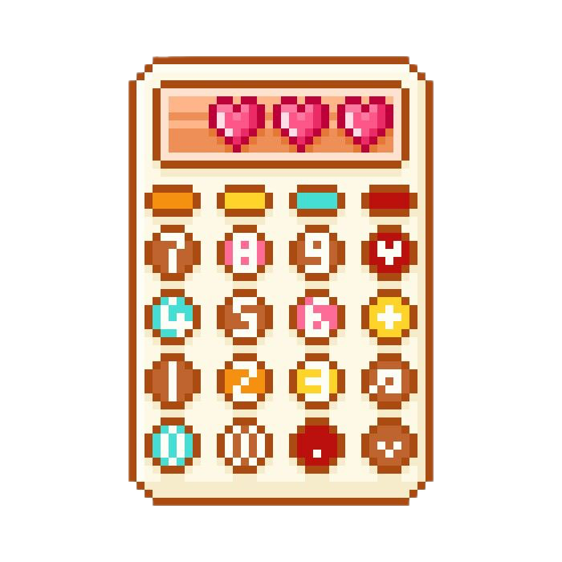

<<<<<<< HEAD

## ✨ About Me

-  Spanish/Bolivian/Polish girl from Malaga, Spain
-  Computer Science Student  
-  Interested in Sustainable IoT, Networks and Trinkets figurines
-  Tech enthusiast & creative developer
=======

  .about-section h2 {
    color: #ff1493;
    text-align: center;
    font-size: 28px;
    margin-bottom: 25px;
    text-shadow: 1px 1px 2px rgba(255, 192, 203, 0.5);
  }

  .about-item {
    display: flex;
    align-items: center;
    margin: 15px 0;
    font-size: 16px;
    color: #333;
  }

  .about-item img {
    width: 35px;
    height: 35px;
    margin-right: 15px;
    filter: drop-shadow(0 2px 4px rgba(0, 0, 0, 0.1));
  }

  .about-item-text {
    font-weight: 500;
    color: #2c3e50;
  }
</style>

  <h2>✨About Me</h2>
  
  

    
    Spanish/Bolivian/Polish girl from Malaga, Spain
  

  

    
    Computer Science Student
  

  

    
    Interested in Sustainable IoT, Networks and Trinkets figurines
  

  

    
    Tech enthusiast & creative developer
  

>>>>>>> 648f8526ffad84e6a1db24269d2acebb1641dc54
